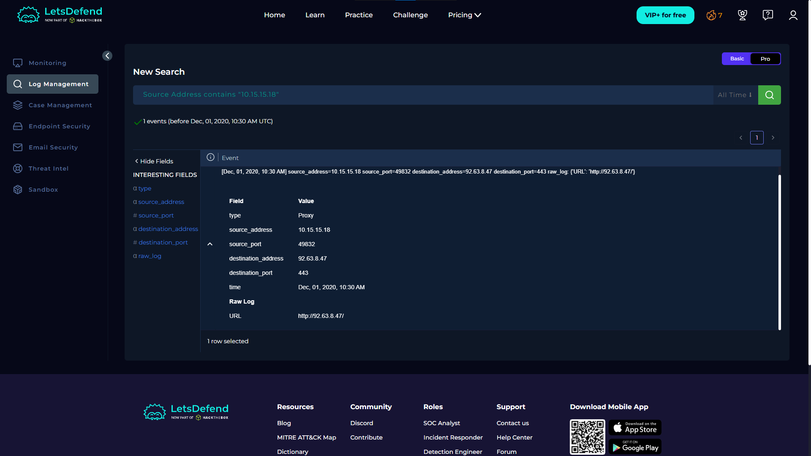

# 🚨 Incident Report: SOC104 - Malware Detected

**Case ID:** 36  
**Platform:** LetsDefend  
**Date:** 2020-12-01  
**Verdict:** True Positive  

---

## 📝 1. Executive Summary
**Alert Severity:** High  
**Status:** Closed  

**Description:**  
A malware alert was triggered for the host **AdamPRD** (`10.15.15.18`). Investigation and threat intelligence sources indicated the presence of malware associated with the **Maze ransomware family**. Network logs showed outbound connections to a known malicious IP address (`92.63.8.47`), consistent with command-and-control (C2) activity. The alert hash corresponded to a compressed archive containing the ransomware payload. The host was successfully contained to prevent further impact.

---

## 🔍 2. Analysis & Investigation

### 2.1 Trigger Event
The SIEM triggered an alert for **"Potential Malware"** based on threat intelligence feeds.
* **Alert Time:** Dec 01, 2020, 10:23 AM  
* **Source IP / Host:** `10.15.15.18` / AdamPRD  
* **Suspicious File Hash:** `f83fb9ce6a83da58b20685c1d7e1e546`  

---

### 2.2 Investigation Steps

#### Step 1: Verification of Activity
I analyzed the **Log Management** tab to verify network activity from the host.
* **Observation:** Logs showed successful outbound connections to `92.63.8.47`.  
* **Context:** The destination IP is not associated with known business-related activity.  
* **Evidence:**  
  > 

---

#### Step 2: Threat Intelligence Check
I checked the suspicious file hash in VirusTotal.
* **VirusTotal Result:** 63/71 security vendors flagged the file as malicious.  
* **File Type:** WinRAR archive containing a malicious payload.  
* **Evidence:**  
  > 

---

#### Step 3: Threat Intelligence & Sandbox Analysis
Sandbox analysis reports (AnyRun) were reviewed to understand the malware behavior.
* **Malware Family:** Reported as **Maze Ransomware**.  
* **Network Behavior:** Sandbox analysis confirmed outbound communication to `92.63.8.47`, consistent with the activity observed in internal logs.  
* **Evidence:**  
  > 

---

## 🛡️ 3. Containment & Remediation
Based on the analysis, the alert was deemed a **True Positive**.

The following containment actions were taken in accordance with SOC incident response playbooks:
1. **Isolation:** The host `AdamPRD` was isolated from the network via EDR to prevent further spread.  
2. **Escalation:** The incident was escalated to **Tier 2 (L2)** for deeper forensic analysis and data recovery procedures.

---

## 🔬 4. Indicators of Compromise (IOCs)

| Type | Value | Description |
| :--- | :--- | :--- |
| **C2 IP Address** | `92.63.8.47` | Command & Control Server |
| **File Hash (MD5)** | `f83fb9ce6a83da58b20685c1d7e1e546` | Malicious Archive (WinRAR) |
| **Payload Hash (SHA256)** | `e8a091a84...c684` | Maze Ransomware Payload |

---

## 🧠 5. Analyst Notes
* **Risk Assessment:** Maze ransomware is reported by threat intelligence sources to be associated with double extortion techniques.  
* **Recommendation:** Review network and proxy logs for potential data exfiltration activity prior to host isolation.  
* **Next Steps:** L2 analysts should verify the availability and integrity of backups for the affected host.
