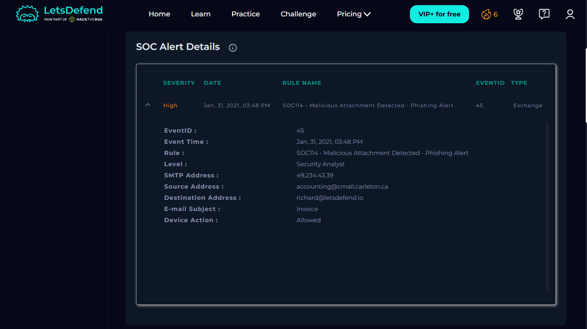

# 🚨 Incident Report: SOC114 - Malicious Attachment Detected

**Case ID:** 45
**Platform:** LetsDefend
**Date:** 2021-01-31
**Verdict:** True Positive

---

## 📝 1. Executive Summary
**Alert Severity:** High
**Status:** Closed

**Description:**
A phishing email containing a malicious Excel attachment (`Invoice.xlsx`) was delivered to an internal user (**Richard**). The attachment was associated with a known Microsoft Office vulnerability (CVE-2017-11882), according to threat intelligence reports. Endpoint security alerts indicated the execution of a credential harvesting tool `(LaZagne.exe)` after the file was opened. The device was isolated, and the malicious email was deleted.

---

## 🔍 2. Analysis & Investigation

### 2.1 Trigger Event
The SIEM triggered an alert for a "Malicious Attachment" based on mail gateway filters.
* **Alert Time:** Jan 31, 2021, 15:48
* **Sender:** `accounting@cmail.carleton.ca`
* **Recipient:** `richard@letsdefend.io`
* **Subject:** Invoice
* **Attachment:** `Invoice.xlsx`

### 2.2 Investigation Steps

#### Step 1: Email Analysis
I analyzed the **Log Management** tab to verify if the email was delivered.
* **Result:** The "Device Action" was **Allowed**, meaning the email reached the user's inbox.
* **Evidence:**
    > 

#### Step 2: Attachment Analysis (Static)
I downloaded the attachment `Invoice.xlsx` and analyzed its hash in VirusTotal.
* **SHA256:** `44e65a641fb970031c5efed324676b5018803e0a768608d3e186152102615795`
* **VirusTotal Result:** **Malicious** (Flagged by multiple vendors).
* **Exploit Detected:** Associated CVE: CVE-2017-11882 `(based on VirusTotal and threat intelligence data)`.
* **Evidence:**
    > 

#### Step 3: Endpoint Analysis (Dynamic)
I checked **Endpoint Security** for the host `Richard` to see if the file was executed.
* **Process:** `LaZagne.exe`.
* **Observation:** The presence of `LaZagne.exe`, a known credential harvesting tool, indicates successful malicious execution and confirms endpoint compromise.
* **Evidence:**
    > 

---

## 🛡️ 3. Containment & Remediation
Based on the analysis, the alert was deemed a **True Positive**.

The following containment actions were taken in accordance with SOC incident response playbooks:
1.  **Isolation:** The host `Richard` was isolated from the network to prevent data exfiltration.
2.  **Email Purge:** The malicious email was deleted from the user's mailbox.
   
---

## 🔬 4. Indicators of Compromise (IOCs)

| Type | Value | Description |
| :--- | :--- | :--- |
| **Sender Email** | `accounting@cmail.carleton.ca` | Phishing Sender |
| **File Hash (SHA256)** | `44e65a641...795` | Malicious Excel File |
| **Malware** | `LaZagne.exe` | Credential Dumping Tool |

---

## 🧠 5. Analyst Notes
* **Root Cause:** The user opened an attachment from an external, unverified sender.
* **Recommendation:** Ensure Microsoft Office is patched to the latest version to mitigate CVE-2017-11882. Conduct phishing awareness training for the affected user `Richard`.
