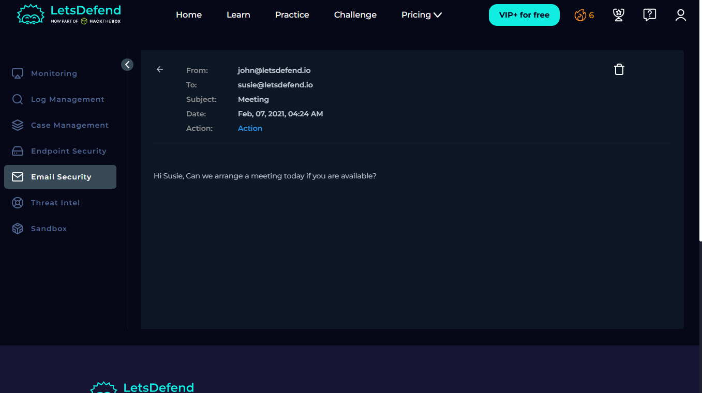

# 🚨 Incident Report: SOC120 - Phishing Mail Detected (Internal)

**Case ID:** 52
**Platform:** LetsDefend
**Date:** 2026-01-22
**Verdict:** False Positive

---

## 📝 1. Executive Summary
**Alert Severity:** Medium
**Status:** Closed

**Description:**
A phishing alert was triggered for an internal email sent from **John** to **Susie** with the subject "Meeting." Upon investigation, it was confirmed that the email contained legitimate business communication and did not include any malicious attachments or URLs. The alert was triggered by keywords in the subject line but is confirmed as a **False Positive**.

---

## 🔍 2. Analysis & Investigation

### 2.1 Trigger Event
The SIEM triggered an alert for "Phishing Mail Detected - Internal to Internal."
* **Alert Time:** Feb 07, 2021, 04:24 AM
* **Sender:** `john@letsdefend.io` (Internal)
* **Recipient:** `susie@letsdefend.io` (Internal)
* **Subject:** `Meeting`
* **Attachment:** None

### 2.2 Investigation Steps

#### Step 1: Header & Log Analysis
I analyzed the **Log Management** tab to verify the source and context.
* **Source IP:** The email originated from a valid local internal IP.
* **Context:** The communication pattern between the sender and recipient appeared normal.

#### Step 2: Content Analysis
I checked **Email Security** to inspect the email body for suspicious content.
* **Observation:** The email contained standard text regarding a meeting.
* **Artifacts:** No attachments or external URLs were present in the email body.
* **Conclusion:** The email is benign.
* **Evidence:**
    > 

---

## 🛡️ 3. Containment & Remediation
Based on the analysis, the alert was deemed a **False Positive**.

**Actions Taken:**
* **No Action Required:** Since the email was legitimate, no isolation or blocking was performed.
* **Ticket Closed:** The incident was marked as closed/false positive in the case management system.

---

## 🔬 4. Indicators of Compromise (IOCs)
* **N/A:** No indicators of compromise were found as this was a false positive.

---

## 🧠 5. Analyst Notes
* **Root Cause:** The alert was likely triggered by the generic subject line "Meeting," which can sometimes be associated with phishing campaigns.
* **Recommendation:** Recommend tuning the SIEM correlation rules to decrease the false positive rate for internal-to-internal emails lacking attachments or URLs.
