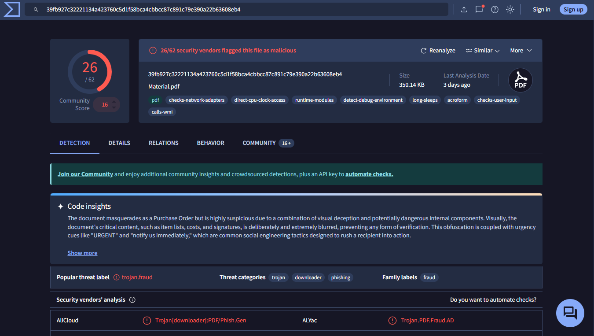

# 🚨 Incident Report: SOC140 - Phishing Mail Detected (Suspicious Task Scheduler)

**Case ID:** 82
**Platform:** LetsDefend
**Date:** 2021-03-21
**Verdict:** True Positive

---

## 📝 1. Executive Summary
**Alert Severity:** Medium
**Status:** Closed

**Description:**
A phishing alert was triggered for an email sent to **Mark** with the subject "**COVID19 Vaccine**". The email contained a password-protected ZIP file (`infected` password) intended to bypass security filters. Static analysis confirmed the attachment contained malware designed to create malicious scheduled tasks. The email gateway successfully **Blocked** the delivery, preventing any endpoint compromise.

---

## 🔍 2. Analysis & Investigation

### 2.1 Trigger Event
The SIEM triggered an alert for "Phishing Mail Detected - Suspicious Task Scheduler."
* **Alert Time:** Mar 21, 2021, 12:26 PM
* **Sender:** `aaronluo@cmail.carleton.ca`
* **Recipient:** `mark@letsdefend.io`
* **Subject:** `COVID19 Vaccine`
* **Attachment:** `Covid19_Vaccine.zip` (containing `Material.pdf.exe`)

### 2.2 Investigation Steps

#### Step 1: Email Analysis
I analyzed the **Email Security** tab to verify the email content and status.
* **Sender Identity:** The sender `aaronluo@cmail.carleton.ca` is an external address and likely compromised or spoofed.
* **Status:** The "Device Action" was **Blocked**.
* **Conclusion:** The email was stopped at the gateway and **did not** reach Mark's inbox.
* **Evidence:**
    > 

#### Step 2: Attachment Analysis (Static)
I downloaded the attachment and checked its hash in VirusTotal.
* **File Hash (MD5):** `72c812cf21909a48eb9cceb9e04b865d`
* **VirusTotal Result:** **Malicious** (Flagged as Trojan/Downloader).
* **Function:** The malware is known to spawn `schtasks.exe` to establish persistence.
* **Evidence:**
    > 

#### Step 3: Endpoint Analysis
I checked **Log Management** to confirm no further activity occurred.
* **Result:** Since the email was blocked, there were no logs for `aaronluo` on the endpoint, and no malicious processes were executed on Mark's machine.

---

## 🛡️ 3. Containment & Remediation
Based on the analysis, the alert was deemed a **True Positive (Blocked)**.

**Actions Taken:**
1.  **Verification:** Confirmed the email was blocked by the Email Gateway.
2.  **No Endpoint Action:** Since the email was never delivered, isolation of Mark's machine was **not required**.
3.  **Ticket Closed:** Marked as True Positive.

---

## 🔬 4. Indicators of Compromise (IOCs)

| Type | Value | Description |
| :--- | :--- | :--- |
| **Sender** | `aaronluo@cmail.carleton.ca` | Phishing Sender |
| **File Hash (MD5)** | `72c812cf21909a48eb9cceb9e04b865d` | Malicious Attachment |
| **Subject** | `COVID19 Vaccine` | Phishing Lure |

---

## 🧠 5. Analyst Notes
* **Recommendation:** Ensure all email gateways are configured to either block or quarantine password-protected attachments that cannot be scanned.
